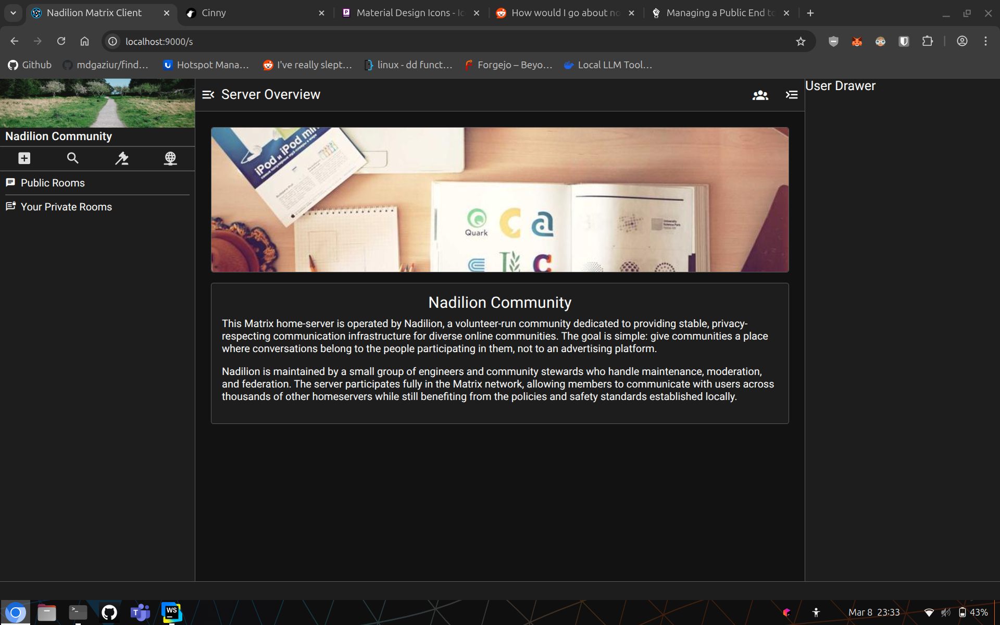

# Nadilion Matrix Client

A cross platform matrix client being worked on for the Nadilion community

## Latest Screenshot
2026.MAR.08



## Contributing

Generally avoid introducing new 3rd party dependencies without a compelling reason.

## Prerequisites
Node.JS 24+
Yarn 4+

### Install the dependencies
```bash
yarn
```

### Start the app in development mode (hot-code reloading, error reporting, etc.)
```bash
yarn quasar dev
```

Access at `http://localhost:9000/`

### Build the app for production
```bash
yarn quasar build
```
